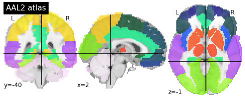
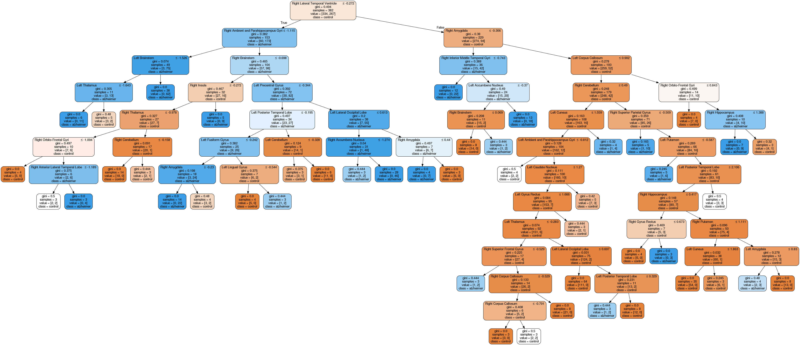

<h1 style="text-align:center"> Alzheimer Prediction Using Gray Matter Density
 </h1>

## Motivation: 
Alzheimer’s disease (AD) affects over 20 million people worldwide. Identification of AD at an
early stage is important for adequate care of patients and for testing of new treatments.
Neuroimaging provides useful information to identify AD (Ewers et al., 2011): atrophy due to gray
matter loss with anatomical magnetic resonance imaging (MRI), hypometabolism with 18 F-
fluorodeoxyglucose positron emission tomography (FDG PET), accumulation of amyloid-beta
protein with amyloid PET imaging. A major interest is then to analyse those markers to identify AD at an early stage. In particular, machine learning methods have the potential to assist in identifying patients with AD by learning discriminative patterns from neuroimaging data.

In this notebook, we test some machine learning aproches espacially tree based algorithms(decsion Trees ,Bagging ,  Xgboost, RandomForest) to identify potential Alzheimer patiant using gray matter density.

## DataSet: 

We will use a dataset composed of neuroimaging features from brain T1w MR images of 752 subjects: 416 controls and 336 with Alzheimer’s disease. Following the pipeline described in [1], all images are first normalized to a
common space, providing a voxel-wise correspondence across subjects. Then, gray matter density is computed at each voxel and averaged over a set of ROIs (Region of Interest) of an atlas, at the beginning we will use the [AAL2 atlas](http://www.gin.cnrs.fr/en/tools/aal/). 

Data comes from several freely available datasets, like [ADNI](http://adni.loni.usc.edu/) and [OASIS](https://www.oasis-brains.org/), and has been pre-processed by the [Clinica](http://www.clinica.run/) team using the procedure explained in [1].

we will  load *dataTP.npz* where :
- **T1x** :  a matrix containing the averaged density (each row is a subject and each column a feature), 
- **y** :  a vector containing the diagnosis (0 for controls and 1 for Alzheimer’s patients)
- **ROIlabelsx** : contains the name of the ROI of each feature. 

Here, **x** can take the name of the three atlases we  have at our disposal: AAL2, [AICHA](http://www.gin.cnrs.fr/fr/outils/aicha/), [HAMMERS](https://brain-development.org/brain-atlases/adult-brain-atlases/).

## Workflow: 

We will use neuroimaging features from brain T1 and MRI images to predict if a subject have  Alzheimer’s disease or not: 

- Load Data  (3 diffrent atals availble ) : 
	- AAL2 Atlas  
	- AICHA Atlas
	-  HAMMER Atlas 
- Scalling an normalizing data
- Fitting Models: 
	- Decision tree
	- Bagging 
	- Random Forest 
	- Xgboost
- Checking Noise effect on the models
- Evaluating Performance 
- Feature Importance Extraction 

## Results: 
### Feature Importance: 
We extracted the most important features or sets of ROI(Region of Interest) in AD classification : 
- 46 Amygdala_R
- 41 Hippocampus_L
- 42 Hippocampus_R
### Decision Tree 

## Reference:

[1] J. Samper-González, N. Burgos, S. Bottani, S. Fontanella, P. Lu, A. Marcoux, A. Routier, J. Guillon, M. Bacci, J. Wen, A. Bertrand, H. Bertin, M.-O. Habert, S. Durrleman, T. Evgeniou, O. Colliot. *Reproducible evaluation of classification methods in Alzheimer's disease: framework and application to MRI and PET data*. NeuroImage, 2018 
